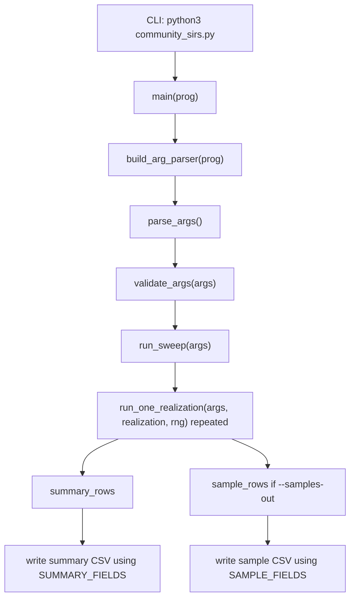
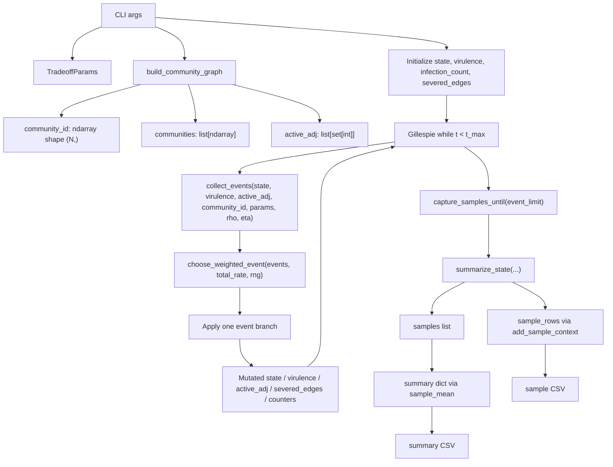
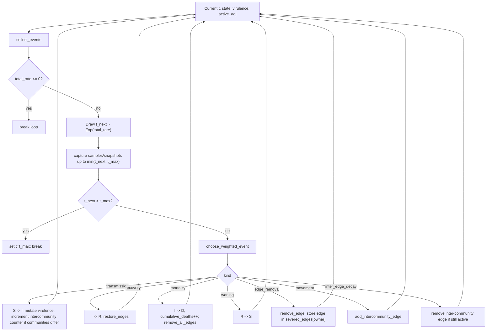
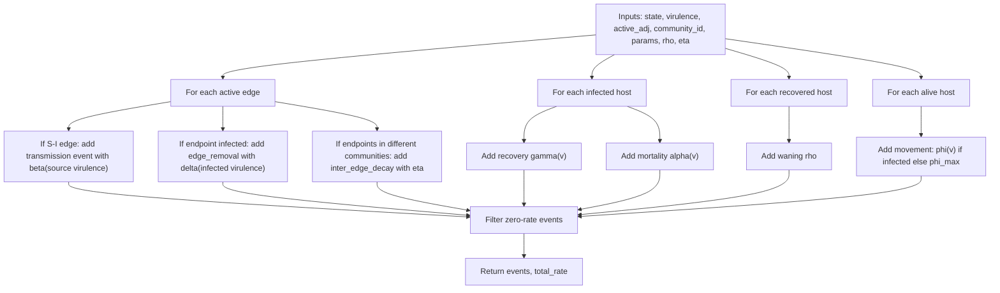
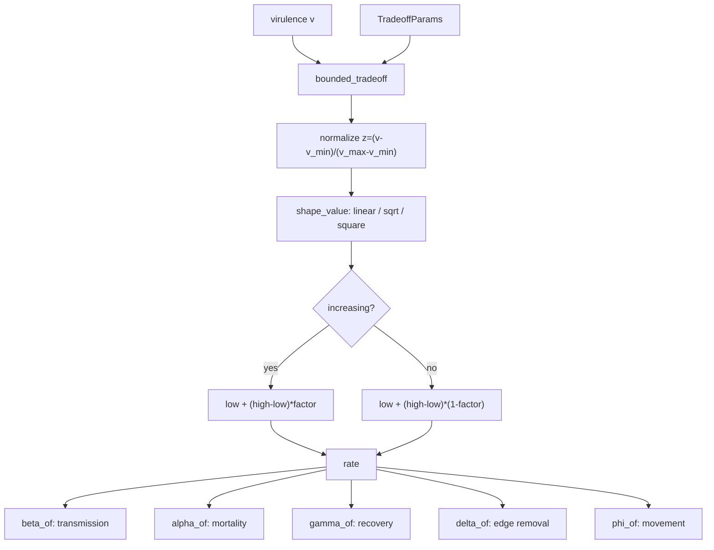
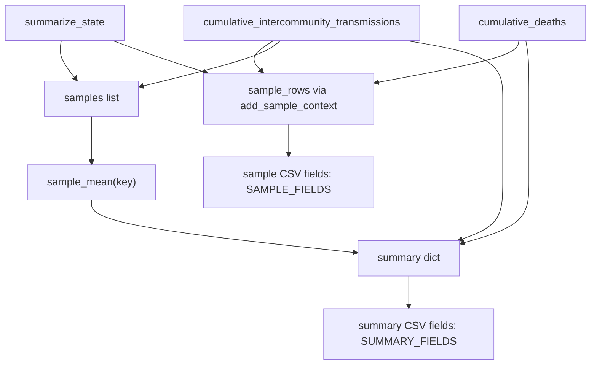

# Code Map: `community_sirs.py`

This document explains the current implementation of
[`community_sirs.py`](/Users/zxz/Workspace/dynamicabm/community_sirs.py). It is
based on the actual code structure and is intended as a debugging and handoff
map. It does not propose or apply code changes.

## 1. Entry Points

Main executable entry point:

```python
if __name__ == "__main__":
    main("community_sirs")
```

This appears at
[`community_sirs.py:852`](/Users/zxz/Workspace/dynamicabm/community_sirs.py:852).

High-level execution:



Importable entry points:

- `main()`: CLI runner.
- `run_sweep(args)`: runs many realizations.
- `run_one_realization(...)`: core simulation engine. Snapshot code can call
  this with `snapshot_times`.
- `build_arg_parser(...)`: shared parser for wrapper scripts.

## 2. Global State And Constants

Global constants:

- `STATE_S = 0`, `STATE_I = 1`, `STATE_R = 2`, `STATE_D = 3`, defined near
  [`community_sirs.py:38`](/Users/zxz/Workspace/dynamicabm/community_sirs.py:38).
- `SUMMARY_FIELDS`: output columns for one row per realization.
- `SAMPLE_FIELDS`: output columns for one row per sampled time point.

Dataclass:

- `TradeoffParams`: immutable container for virulence bounds, rate bounds, and
  shape choices. It is built once per realization from CLI args, then passed
  into rate functions and event collection.

Important mutable simulation objects inside `run_one_realization`:

- `state: np.ndarray[int8]`, shape `(N,)`
- `virulence: np.ndarray[float64]`, shape `(N,)`
- `infection_count: np.ndarray[int64]`, shape `(N,)`
- `active_adj: list[set[int]]`, length `N`
- `severed_edges: list[set[tuple[int, int]]]`, length `N`
- `cumulative_deaths: int`
- `cumulative_intercommunity_transmissions: int`
- `samples: list[dict[str, float]]`
- `sample_rows: list[dict]`
- `snapshots: list[dict]`

## 3. Function Map

| Function | Purpose | Inputs | Reads / modifies | Returns | Called by | Calls |
|---|---|---|---|---|---|---|
| `main` | CLI orchestration and CSV writing | `prog` | filesystem output paths | none | script entry / wrapper | `build_arg_parser`, `validate_args`, `run_sweep` |
| `build_arg_parser` | Defines CLI arguments | `prog` | none | `argparse.ArgumentParser` | `main` | argparse APIs |
| `validate_args` | Fails fast on invalid params | `args` | none | none or exits | `main` | `getattr` |
| `run_sweep` | Repeats independent realizations | `args` | progress stderr | `(rows, all_samples)` | `main` | `run_one_realization` |
| `run_one_realization` | Core Gillespie ABM | `args`, `realization`, `rng`, flags | mutates state, graph, counters | summary or `(summary, sample_rows, snapshots)` | `run_sweep`, snapshot scripts | most helpers |
| `split_communities` | Assigns nodes to K groups | `N`, `K` | none | `(community_id, communities)` | `build_community_graph` | NumPy |
| `build_community_graph` | Builds local Watts-Strogatz graph | `N`, `K`, `kbar`, `rewiring_prob`, `seed` | none | `community_id`, `communities`, `active_adj`, `baseline_adj` | `run_one_realization` | `split_communities`, NetworkX |
| `active_edges` | Converts adjacency sets to unique edge set | `active_adj` | reads graph | `set[(u, v)]` | many metrics/events | none |
| `realized_clustering` | Average clustering among alive nodes | `active_adj`, `alive_mask` | reads graph | `float` | `summarize_state` | `active_edges`, NetworkX |
| `shape_value` | Applies linear/concave/convex curve | `z`, `shape` | none | scalar or array | `bounded_tradeoff` | NumPy |
| `bounded_tradeoff` | Maps virulence to bounded rate | `v`, params, low/high, shape, direction | params | scalar or array | rate functions | `shape_value` |
| `beta_of` | Transmission rate | `v`, params | params | rate | `collect_events` | `bounded_tradeoff` |
| `alpha_of` | Disease mortality rate | `v`, params | params | rate | `collect_events` | `bounded_tradeoff` |
| `gamma_of` | Recovery rate | `v`, params | params | rate | `collect_events` | `bounded_tradeoff` |
| `delta_of` | Behavioral edge removal rate | `v`, params | params | rate | `collect_events` | `bounded_tradeoff` |
| `phi_of` | Infected movement rate | `v`, params | params | rate | `collect_events` | `bounded_tradeoff` |
| `collect_events` | Enumerates Gillespie events and rates | state, virulence, graph, params, rho, eta | reads current state/graph | `(events, total_rate)` | `run_one_realization` | `active_edges`, rate funcs |
| `choose_weighted_event` | Samples one event by rate | events, total_rate, rng | RNG | `(kind, payload)` | `run_one_realization` | RNG |
| `restore_edges` | Restores edges severed during infection | host id, state, graph, severed list | mutates graph, severed_edges | none | recovery branch | none |
| `remove_all_edges` | Removes all edges of dead host | host id, graph, severed list | mutates graph, severed_edges | none | mortality branch | none |
| `add_intercommunity_edge` | Adds temporary edge to another community | host, state, communities, graph, rng | mutates graph | `bool` | movement branch | RNG |
| `remove_edge` | Removes undirected edge | edge, graph | mutates graph | none | edge removal / decay | none |
| `count_inter_edges` | Counts active cross-community edges | graph, community_id | reads graph | `int` | `summarize_state` | `active_edges` |
| `summarize_state` | Computes sample/final metrics | t, state, virulence, graph, community_id | reads current state | dict metrics | sampling/final | `active_edges`, `count_inter_edges`, `realized_clustering` |
| `snapshot_state` | Deep-copies state for network snapshots | t, state, virulence, graph, community_id, deaths | copies mutable state | dict snapshot | nested `capture_snapshots_until` | `copy.deepcopy` |
| `add_sample_context` | Adds metadata/counters to sample row | sample dict, realization, seed, counters, eta | reads sample | CSV-ready dict | nested `capture_samples_until` | none |
| `_edge` | Canonical undirected edge tuple | u, v | none | `(min, max)` | edge-removal branch | none |

## 4. Major Data Flow

The most important chain is:



The graph starts as only within-community Watts-Strogatz edges. Later:

- `movement` adds cross-community edges.
- `inter_edge_decay` removes cross-community edges.
- `edge_removal` can remove any edge incident to an infected host.
- `recovery` restores behaviorally severed edges owned by that recovered host.
- `mortality` removes all active edges touching the dead host.

## 5. Gillespie Loop Detail

The complicated center is `run_one_realization`, especially around
[`community_sirs.py:596`](/Users/zxz/Workspace/dynamicabm/community_sirs.py:596).



## 6. Event Construction Detail

`collect_events` is the rate builder. It does not mutate state.



Important subtlety: events are explicit tuples like:

```python
("transmission", (susceptible, source), rate)
```

That payload order matters downstream.

## 7. Tradeoff Flow



## 8. Output Flow



Note: `summarize_state` itself does not compute cumulative deaths or cumulative
cross-community transmissions. Those are counters maintained in
`run_one_realization` and attached afterward.

## 9. Important Variable Types

| Variable | Type / shape | Meaning |
|---|---|---|
| `state` | `np.ndarray`, shape `(N,)`, dtype `int8` | host disease state: 0 S, 1 I, 2 R, 3 D |
| `virulence` | `np.ndarray`, shape `(N,)`, dtype `float64` | current virulence phenotype per host |
| `community_id` | `np.ndarray`, shape `(N,)`, dtype `int64` | fixed community index per host |
| `communities` | `list[np.ndarray]`, length `K` | node ids in each community |
| `active_adj` | `list[set[int]]`, length `N` | mutable active contact network |
| `baseline_adj` | `list[set[int]]`, length `N` | initial local graph; currently returned but unused in this file |
| `severed_edges` | `list[set[tuple[int, int]]]`, length `N` | edges removed due to infected host behavior, restored on recovery |
| `events` | `list[tuple[str, tuple, float]]` | explicit Gillespie event list |
| `samples` | `list[dict[str, float]]` | post-burn-in sampled metrics used for summary means |
| `sample_rows` | `list[dict]` | CSV-ready sample rows |
| `snapshots` | `list[dict]` | deep-copied graph/state snapshots |
| `params` | `TradeoffParams` | immutable tradeoff/rate settings |

## 10. Debugging Points

Good places where bugs can propagate:

- `active_adj`: heavily mutable. It is changed by movement, behavioral removal,
  recovery, mortality, and inter-edge decay. If edge counts look wrong, inspect
  this first.
- `severed_edges`: recovery restores only edges recorded under the infected
  owner. If this bookkeeping is wrong, contacts may fail to return or return
  incorrectly.
- `collect_events`: rebuilds every possible event each Gillespie step. Any
  wrong rate or missing event here affects the entire stochastic process.
- Transmission payload: `("transmission", (susceptible, source), rate)`. If this
  order is misunderstood, virulence inheritance and cross-community
  transmission counting become wrong.
- `cumulative_intercommunity_transmissions`: increments only on successful
  transmission when `community_id[susceptible] != community_id[source]`. It is
  not the same as inter-community edge creation or active inter-community edge
  count.
- `infection_count`: increments on infection but is not currently output or used
  downstream. This is real state, but currently diagnostic/dead-end state.
- `baseline_adj`: built and returned, but ignored as `_baseline_adj` inside
  `run_one_realization`.
- `snapshot_state`: copies deaths but not
  `cumulative_intercommunity_transmissions`; this may be intentional, but
  snapshot metadata cannot directly access that counter from this snapshot dict
  unless the snapshot script computes or stores it elsewhere.
- `sample_mean`: assumes every internal `sample` dict has the requested key. The
  current code adds `cumulative_intercommunity_transmissions` before appending,
  so that key is safe now.

## 11. Suggested Debugging Order

If final CSVs or plots look wrong, inspect in this order:

1. `validate_args(args)`: confirm parameters are what you think they are.
2. `build_community_graph`: check `community_id`, community sizes, initial
   `active_adj`, and initial inter-community edges. Initial inter-community edge
   count should be zero.
3. `collect_events`: inspect event counts by kind and total rates. This tells
   you whether the model is offering the right possible events.
4. Event application branches in `run_one_realization`: especially
   transmission, movement, edge removal, recovery, mortality, and inter-edge
   decay.
5. `active_adj` after each event type: this is the core mutable network state.
6. `cumulative_intercommunity_transmissions`: verify it changes only during
   successful cross-community transmissions.
7. `summarize_state`: verify counts and edge metrics from the current state.
8. `capture_samples_until`: verify sample timing, especially burn-in and sample
   interval.
9. `summary` construction: verify `sample_mean(...)` matches the sampled rows.
10. CSV writing in `main`: usually simple, but check field names if columns are
    missing.
